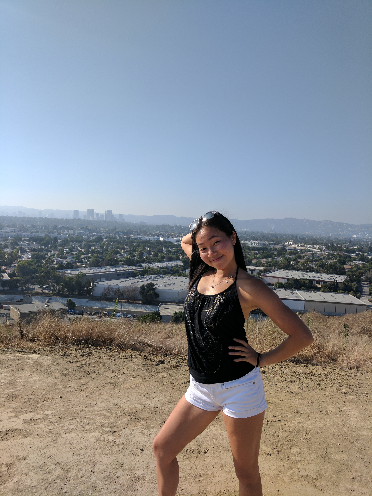

    

I am a junior at Pomona College majoring in computer science and economics. While CS is my main focus at school, I have developed a strong interest in psychology and health/wellness. What really fascinates me within the world of computer science is the social impact of technology and how we as a community are influenced by its developments. I also love talking to people so reach out if you want to chat about anything ! 

[Check out my resume here](https://github.com/aliceetan/aliceetan.github.io/blob/master/about/AliceTan_TechResume2017.pdf?raw=true)

## Gallery 

 
    
    
    
    
    
    
    
        

    
   
  
